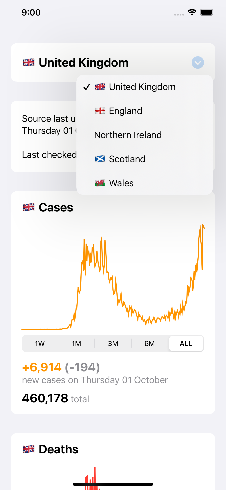
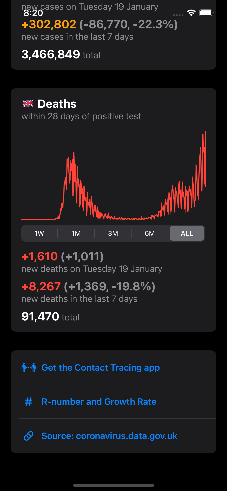
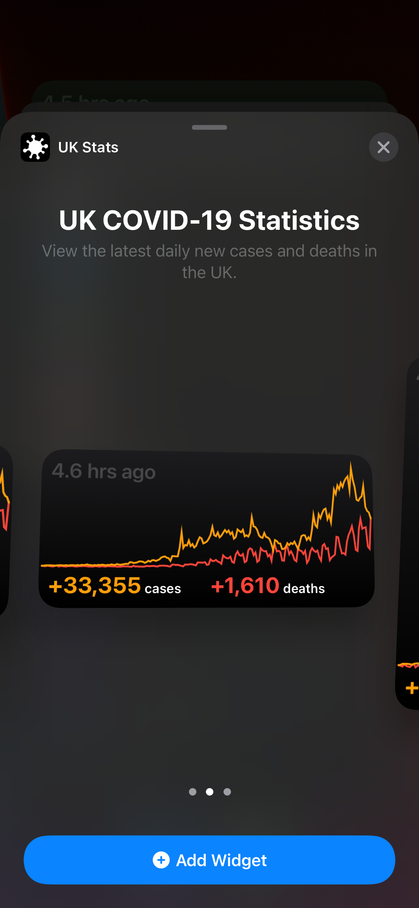
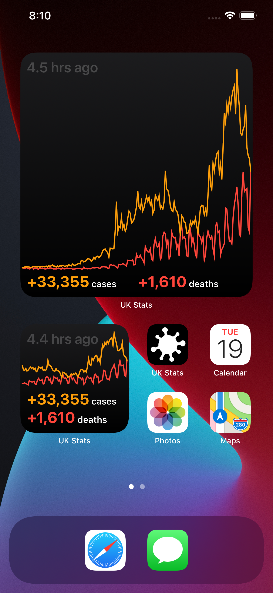
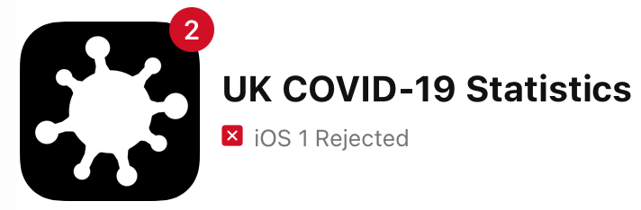

    
    
    
    

 
# 🇬🇧 UK COVID-19 Statistics
This app was created with the intention of publishing to the AppStore. 

The primary purpose of this app is to share information with the UK public in the hopes that people will change their behavior to help us all control the spread of this virus.

### 🏙 Screenshots

 

 

### 😞 Rejection

Understandably, Apple has rejected this app as it contains information regarding the COVID-19 pandemic.

Only recognised institutions are allowed to create apps relating to the pandemic to help curb misinformation.

> We found in our review that your app provides services or requires sensitive user information related to the COVID-19 pandemic. Since the COVID-19 pandemic is a public health crisis, services and information related to it are considered to be part of the healthcare industry. In addition, the seller and company names associated with your app are not from a recognized institution, such as a governmental entity, hospital, insurance company, non-governmental organization, or university.  

For more information: [Ensuring the Credibility of Health & Safety Information](https://developer.apple.com/news/?id=03142020a)

### 👨🏻‍💻 API

[https://coronavirus.data.gov.uk/developers-guide](https://coronavirus.data.gov.uk/developers-guide)

### 🧐 Features
 
- Widget showing latest daily cases 🧪 and deaths 🪦
- 🔄 Automatically reload data every 15 minutes
- 📈 Chart timescale can be changed (All data, 6 months, 3 months, 1 month, 1 week)
- Change dataset for (🇬🇧 UK, 🏴󠁧󠁢󠁥󠁮󠁧󠁿 England, Northern Ireland, 🏴󠁧󠁢󠁳󠁣󠁴󠁿 Scotland, 🏴󠁧󠁢󠁷󠁬󠁳󠁿 Wales)

### 👨🏻‍⚖️ Disclaimer

> I have decided to open the sourcecode for this app for the following reasons:
> 
> - Transparency in the hopes that it might be approved for the AppStore one day
> - To share SwiftUI code with other iOS developers 
> - To improve this app through contributions
> - In the hopes that other iOS developers may use the app themselves
> - To show how awesome SwiftUI is 🥳
